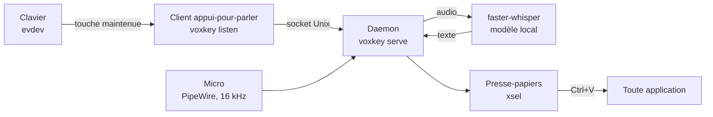

<p align="center">
  
</p>

<h1 align="center">voxkey</h1>

<p align="center">
  Dictée en appui-pour-parler sous Linux, transcrite localement avec <a href="https://github.com/SYSTRAN/faster-whisper">faster-whisper</a>.<br>
  Maintenez une touche, parlez, relâchez : vos mots arrivent dans le presse-papiers, prêts à coller n'importe où.<br>
  Du <b>speech-to-text</b> créé par un utilisateur flemmard pour parler aux IA : dictez directement dans <b>Claude Code</b> / <b>Codex</b> depuis le terminal.
</p>

<p align="center"><a href="README.md">English</a></p>

> voxkey est un projet indépendant. Il n'est ni affilié à, ni approuvé, ni
> sponsorisé par Anthropic ou OpenAI. « Claude » et « Codex » sont des marques
> de leurs propriétaires respectifs, utilisées ici uniquement pour identifier
> les produits compatibles.

---


https://github.com/user-attachments/assets/a16d01f2-38ca-4971-9223-3566d6746159


## Pourquoi voxkey

- **Né pour parler aux IA.** voxkey a été écrit pour dicter des prompts à
  Claude Code au lieu de les taper : un prompt parlé prend quelques secondes,
  un prompt tapé prend des minutes. Il fonctionne aussi bien partout où vous
  écrivez.
- **Local d'abord.** La voix ne quitte jamais votre machine. La transcription
  tourne sur votre propre CPU ou GPU avec faster-whisper. Pas de cloud, pas de
  compte, pas de télémétrie.
- **Fonctionne partout où l'on peut coller.** voxkey copie la transcription
  dans le presse-papiers au lieu de simuler des frappes clavier, donc il
  fonctionne dans toute application, quel que soit le focus ou le toolkit.
- **Déclenchement rapide.** Le micro reste ouvert avec un pré-tampon glissant,
  donc les premiers mots prononcés pendant l'appui sur la touche sont déjà
  capturés. Pas de « attendez le bip ».
- **Intégré au bureau.** Services systemd utilisateur, fenêtre de contrôle
  GTK, icône de zone de notification avec état en direct (repos,
  enregistrement, terminé, erreur) et carillon de fin.
- **Multilingue.** Dictez dans plus de 18 langues et passez de l'une à l'autre
  en une commande ou un clic. L'interface elle-même existe en anglais et en
  français.

## Comment ça marche



1. **Le daemon** (`voxkey serve`, un programme qui tourne en fond) garde le
   modèle Whisper chargé en mémoire et le micro ouvert avec un pré-tampon
   glissant, pour que la dictée démarre instantanément.
2. **Le client appui-pour-parler** (`voxkey listen`) surveille tous vos
   claviers via evdev (la couche d'entrée du noyau, donc X11 et Wayland
   fonctionnent pareil). Quand vous maintenez la touche configurée au moins
   une seconde, il demande au daemon d'enregistrer.
3. **L'enregistrement s'arrête** quand vous relâchez la touche, ou
   automatiquement après une durée de silence configurable.
4. **La transcription** est locale, via faster-whisper. Sur un GPU CUDA le
   modèle par défaut est `medium` ; sur CPU c'est `small`. Détection de voix
   et filtrage anti-hallucination sont appliqués.
5. **Le résultat** est copié dans le presse-papiers et un carillon le
   confirme. Collez-le où vous voulez.

Pas d'injection de frappes ni de capture de touche : voxkey ne fait que lire
les événements d'entrée et écrire dans le presse-papiers.

## Installation

Nécessite Python 3.12+ et Linux. L'audio passe par PipeWire (compatible
PulseAudio).

```bash
# Outil presse-papiers + bibliothèques GTK pour l'interface et la zone de notification (Debian/Ubuntu/Mint)
sudo apt install xsel python3-gi gir1.2-gtk-3.0 gir1.2-ayatanaappindicator3-0.1

# Lire le clavier demande d'appartenir au groupe input
sudo usermod -aG input "$USER"   # puis déconnectez-vous et reconnectez-vous

# Récupérer le code et l'installer (pipx recommandé, pip simple fonctionne aussi)
git clone https://github.com/Evaexe117/voxkey
cd voxkey
pipx install ".[gui]"
```

Puis installez l'intégration bureau (services systemd utilisateur, entrée de
menu, lancement automatique de l'icône) :

```bash
./packaging/install.sh
systemctl --user enable --now voxkey.service voxkey-ptt.service
```

Le premier démarrage télécharge le modèle Whisper, ce qui peut prendre
quelques minutes.

Envie d'essayer sans services ? `voxkey once` enregistre une seule dictée et
affiche le texte sur la sortie standard.

## Utilisation

Maintenez **Ctrl droite** (le défaut), parlez, relâchez. C'est tout.

| Commande | Ce qu'elle fait |
|---|---|
| `voxkey serve` | Lance le daemon (modèle en mémoire, micro ouvert) |
| `voxkey listen` | Lance le client appui-pour-parler |
| `voxkey once` | Une dictée, texte affiché sur la sortie standard |
| `voxkey lang [code]` | Change la langue de dictée, ou passe à la suivante sans code |
| `voxkey gui` | Ouvre la fenêtre de contrôle (état + réglages) |
| `voxkey tray` | Lance l'icône de zone de notification |
| `voxkey devices` | Liste les micros et les claviers détectés |
| `voxkey stop` | Arrête le daemon |

## Configuration

Tout vit dans `~/.config/voxkey/config.toml`. Chaque réglage est optionnel ;
les clés inconnues et les valeurs invalides sont rejetées au démarrage avec
une erreur précise.

```toml
language = "en"            # langue de dictée courante
languages = ["en", "fr"]   # l'ensemble que `voxkey lang` fait défiler
model = "medium"           # tiny | base | small | medium | large-v3 (défaut : selon le matériel)
key = "RIGHTCTRL"          # nom de touche evdev, sans le préfixe KEY_
pre_buffer_secs = 1.0      # audio conservé d'avant l'appui sur la touche
silence_secs = 3.0         # arrêt après ce temps de silence
wait_secs = 10.0           # abandon si aucune parole du tout
log_transcripts = false    # garder un journal local de ce que vous dictez
```

L'onglet Réglages de l'interface modifie ce même fichier (commentaires
préservés) et ne redémarre que les services qui en ont besoin. Il inclut un
bouton « Détecter » qui capture directement la touche de votre choix.

### Indices de vocabulaire

Whisper écorche parfois les noms, le jargon ou les mots propres à un projet.
Déposez des fichiers texte dans `~/.config/voxkey/hints.d/` (global) ou dans
un dossier `.voxkey-hints.d/` de votre projet : leur contenu est fourni au
modèle comme contexte à chaque dictée.

## Transcription à distance

Une machine puissante sur votre réseau ? Faites-y tourner le modèle et
continuez à dicter depuis un portable léger :

```bash
# Sur la grosse machine (sans écran, ni micro ni clavier nécessaires)
voxkey serve --listen 0.0.0.0:5555

# Sur le portable
voxkey serve --remote grossemachine:5555
```

L'audio est envoyé brut en mono 16 kHz sur TCP. Attention : ce trafic n'est
pas chiffré ; réservez-le à un réseau de confiance ou passez par un tunnel
SSH ou un VPN.

## Bon à savoir

- **La touche peut rester un modificateur.** Avec Ctrl droite par défaut, les
  appuis courts (comme Ctrl+V) sont ignorés ; seul un maintien d'une seconde
  ou plus démarre une dictée.
- **Presse-papiers, pas de frappe simulée.** Si `xsel` manque, la
  transcription ne peut pas être livrée et une cloche d'avertissement sonne à
  la place du carillon.
- **Le micro reste ouvert** tant que le daemon tourne. C'est ce qui rend le
  pré-tampon possible.
- **La calibration au démarrage** échantillonne une demi-seconde de bruit
  ambiant pour régler le seuil de silence, et réessaie plusieurs fois si le
  micro ne renvoie que du silence pur.
- **Wayland** : la lecture des touches est native (evdev). La livraison au
  presse-papiers passe par le presse-papiers X, donc XWayland doit être
  disponible, ce qui est le cas sur pratiquement tous les bureaux.

## Développement

```bash
git clone https://github.com/Evaexe117/voxkey
cd voxkey
python -m venv .venv && . .venv/bin/activate
pip install -e ".[dev,gui]"
pytest        # 256 tests
ruff check .
mypy
```

La CI exécute ruff, mypy (strict) et toute la suite de tests sur Python 3.12
et 3.13. Voir [CONTRIBUTING.md](CONTRIBUTING.md) pour les règles de
contribution et de traduction ; les failles se signalent en privé comme
décrit dans [SECURITY.md](SECURITY.md).

## Licence

[MIT](LICENSE)
