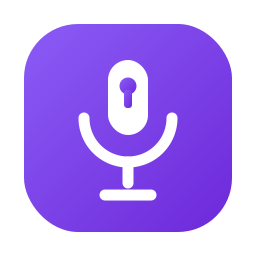
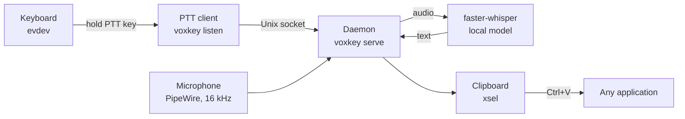

<p align="center">
  
</p>

<h1 align="center">voxkey</h1>

<p align="center">
  Push-to-talk dictation for Linux, transcribed locally with <a href="https://github.com/SYSTRAN/faster-whisper">faster-whisper</a>.<br>
  Hold a key, speak, release: your words land in the clipboard, ready to paste anywhere.
</p>

---

## Why voxkey

- **Local first.** Speech never leaves your machine. Transcription runs on your own CPU or GPU with faster-whisper. No cloud, no account, no telemetry.
- **Works everywhere you can paste.** voxkey copies the transcript to the clipboard instead of simulating keystrokes, so it works in any application, regardless of focus or toolkit.
- **Fast to trigger.** The microphone stays open with a rolling pre-buffer, so the first words you say while pressing the key are already captured. No "wait for the beep".
- **Desktop integrated.** Systemd user services, a GTK control window, a tray icon with live state (idle, recording, done, error), and a completion chime.
- **Multilingual.** Dictate in 18+ languages and cycle between your favourites with one command or one click. The UI itself is available in English and French.

## How it works



1. **The daemon** (`voxkey serve`) keeps the Whisper model loaded in memory and the microphone open with a rolling pre-buffer, so dictation starts instantly.
2. **The push-to-talk client** (`voxkey listen`) watches all your keyboards through evdev (the kernel input layer, so it works on X11 and Wayland alike). When you hold the configured key for at least one second, it asks the daemon to record.
3. **Recording stops** when you release the key, or automatically after a configurable stretch of silence.
4. **Transcription** runs locally through faster-whisper. On a CUDA GPU the default model is `medium`; on CPU it is `small`. Voice activity detection and anti-hallucination filtering are applied.
5. **The result** is copied to the clipboard and a chime confirms it. Paste it wherever you want.

There is no keystroke injection and no key grabbing: voxkey only reads input events and writes to the clipboard.

## Installation

Requires Python 3.12+ and Linux. Audio is expected through PipeWire (PulseAudio compatible).

```bash
# The app itself (pipx recommended, plain pip works too)
pipx install "voxkey[gui]"

# Clipboard tool + GTK libraries for the GUI and tray (Debian/Ubuntu/Mint)
sudo apt install xsel python3-gi gir1.2-gtk-3.0 gir1.2-ayatanaappindicator3-0.1

# Reading the keyboard requires membership of the input group
sudo usermod -aG input "$USER"   # then log out and back in
```

Then install the desktop integration (systemd user units, application menu entry, tray autostart):

```bash
git clone https://github.com/Evaexe117/voxkey
./voxkey/packaging/install.sh
systemctl --user enable --now voxkey.service voxkey-ptt.service
```

The first start downloads the Whisper model, which can take a few minutes.

Prefer to try it without services? `voxkey once` records a single dictation and prints the text to stdout.

## Usage

Hold **Right Ctrl** (the default), speak, release. That's it.

| Command | What it does |
|---|---|
| `voxkey serve` | Run the daemon (model resident, microphone open) |
| `voxkey listen` | Run the push-to-talk client |
| `voxkey once` | One dictation, text printed on stdout |
| `voxkey lang [code]` | Switch dictation language, or cycle if no code given |
| `voxkey gui` | Open the control window (status + settings) |
| `voxkey tray` | Run the tray icon |
| `voxkey devices` | List microphones and detected keyboards |
| `voxkey stop` | Stop the daemon |

## Configuration

Everything lives in `~/.config/voxkey/config.toml`. Every setting is optional; unknown keys and invalid values are rejected at startup with a precise error.

```toml
language = "en"            # current dictation language
languages = ["en", "fr"]   # the set that `voxkey lang` cycles through
model = "medium"           # tiny | base | small | medium | large-v3 (default: auto by hardware)
key = "RIGHTCTRL"          # evdev key name, without the KEY_ prefix
pre_buffer_secs = 1.0      # audio kept from before the key press
silence_secs = 3.0         # stop after this much silence
wait_secs = 10.0           # give up if no speech at all
log_transcripts = false    # keep a local log of what you dictated
```

The GUI's Settings tab edits the same file (comments preserved) and restarts only the services that need it. It includes a "Detect" button that captures your chosen push-to-talk key directly.

### Vocabulary hints

Whisper sometimes mangles names, jargon or project-specific words. Drop text files into `~/.config/voxkey/hints.d/` (global) or a `.voxkey-hints.d/` directory in your project, and their content is fed to the model as context for every dictation.

## Remote transcription

Got a beefy machine on your network? Run the model there and keep dictating from a lightweight laptop:

```bash
# On the big machine (headless, no mic or keyboard needed)
voxkey serve --listen 0.0.0.0:5555

# On the laptop
voxkey serve --remote bigmachine:5555
```

Audio is streamed as raw 16 kHz mono over TCP. Note that this traffic is not encrypted; use it on a trusted network or through an SSH tunnel or VPN.

## Good to know

- **The push-to-talk key can stay a modifier.** With the default Right Ctrl, short presses (like Ctrl+V) are ignored; only a hold of one second or more starts a dictation.
- **Clipboard, not typing.** If `xsel` is missing, the transcript cannot be delivered and a warning bell rings instead of the done chime.
- **The microphone stays open** while the daemon runs. That is what makes the pre-buffer possible.
- **Startup calibration** samples half a second of room noise to set the silence threshold, and retries a few times if the microphone reports pure silence.
- **Wayland**: key reading works natively (evdev). Clipboard delivery uses the X clipboard, so XWayland must be available, which it is on virtually every desktop.

## Development

```bash
git clone https://github.com/Evaexe117/voxkey
cd voxkey
python -m venv .venv && . .venv/bin/activate
pip install -e ".[dev,gui]"
pytest        # 256 tests
ruff check .
mypy
```

CI runs ruff, mypy (strict) and the full test suite on Python 3.12 and 3.13.

## License

[MIT](LICENSE)
